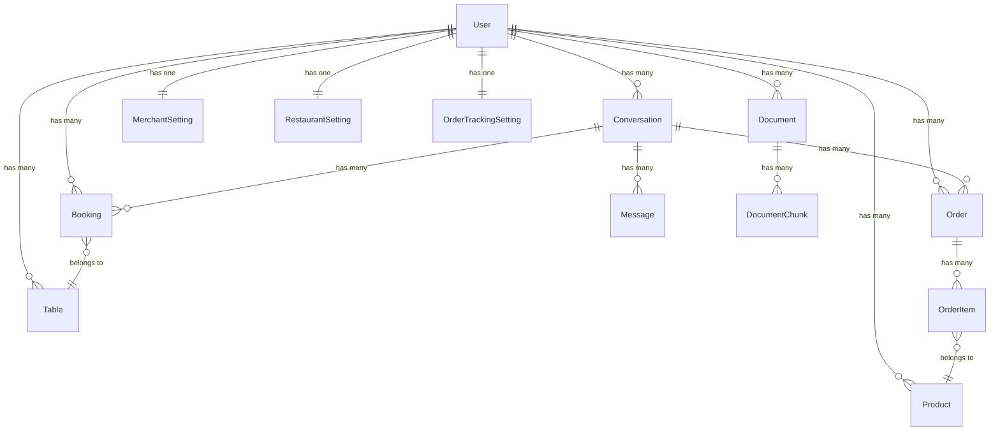

# Janji Chat - System Architecture Documentation

## Overview

Janji Chat is an AI-powered WhatsApp chatbot platform for businesses. It supports two business types:

-   **Restaurant** - For table booking and reservation management
-   **Order Tracking** - For product ordering and delivery management

---

## Database Models & Relationships



---

## Models Reference

### User (Core)

| Field                    | Type      | Description                      |
| ------------------------ | --------- | -------------------------------- |
| role                     | string    | `admin` or `merchant`            |
| business_type            | string    | `restaurant` or `order_tracking` |
| whatsapp_phone_number_id | encrypted | WhatsApp API phone number ID     |
| whatsapp_access_token    | encrypted | WhatsApp API token               |

**Relationships:**

-   `hasMany` → Booking, Order, Conversation, Document, Product, Table
-   `hasOne` → MerchantSetting, RestaurantSetting, OrderTrackingSetting

---

### Conversation

| Field             | Type    | Description                  |
| ----------------- | ------- | ---------------------------- |
| whatsapp_id       | string  | WhatsApp conversation ID     |
| phone_number      | string  | Customer phone number        |
| customer_name     | string  | Customer name                |
| mode              | string  | `ai` or `admin`              |
| needs_reply       | boolean | Escalation flag              |
| escalation_reason | string  | Why escalated                |
| context_type      | string  | Current conversation context |
| context_data      | json    | Context-specific data        |

**Context Types:**

-   `awaiting_booking_confirmation` - Booking pending confirmation
-   `booking_flow` - In booking process
-   `awaiting_cancellation_confirmation` - Cancel pending
-   `booking_selection` - Multiple bookings, needs selection
-   `order_flow` - In order process
-   `awaiting_order_confirmation` - Order pending confirmation

**Relationships:**

-   `hasMany` → Message, Booking, Order

---

### Booking (Restaurant)

| Field         | Type    | Description                         |
| ------------- | ------- | ----------------------------------- |
| booking_date  | date    | Reservation date                    |
| booking_time  | time    | Reservation time                    |
| pax           | integer | Number of guests                    |
| status        | string  | `pending`, `confirmed`, `cancelled` |
| reminder_sent | boolean | Reminder notification sent          |

**Relationships:**

-   `belongsTo` → Conversation, Table

---

### Order (Order Tracking)

| Field              | Type     | Description                    |
| ------------------ | -------- | ------------------------------ |
| fulfillment_type   | string   | `pickup` or `delivery`         |
| delivery_address   | string   | For delivery orders            |
| requested_datetime | datetime | Requested pickup/delivery time |
| status             | string   | See statuses below             |
| total_amount       | decimal  | Order total                    |

**Statuses:** `pending_payment` → `processing` → `completed` / `cancelled`

**Relationships:**

-   `belongsTo` → User, Conversation
-   `hasMany` → OrderItem

---

### Message

| Field        | Type   | Description                                    |
| ------------ | ------ | ---------------------------------------------- |
| direction    | string | `inbound` (customer) or `outbound` (bot/admin) |
| sender_type  | string | `customer`, `ai`, or `admin`                   |
| content      | text   | Message content                                |
| message_type | string | `text`, `image`, `audio`, etc.                 |

**Relationships:**

-   `belongsTo` → Conversation

---

### Settings Models

| Model                | Purpose                                                                           |
| -------------------- | --------------------------------------------------------------------------------- |
| MerchantSetting      | General settings: business name, AI tone, templates, email notifications          |
| RestaurantSetting    | Restaurant-specific: opening/closing time, slot duration, earliest/latest booking |
| OrderTrackingSetting | Order tracking-specific: pickup address, order prefix                             |

---

### Knowledge Base

| Model         | Purpose                              |
| ------------- | ------------------------------------ |
| Document      | Uploaded files for AI knowledge base |
| DocumentChunk | Vectorized chunks for RAG retrieval  |

---

## Backend Services

### 1. ConversationHandler

**Main entry point for message processing**

```
Webhook → ConversationHandler::handleIncomingMessage()
    ↓
    1. Get/Create Conversation
    2. Store inbound Message
    3. Check if admin mode → skip AI
    4. Send greeting (if new)
    5. processWithAI()
        ↓
        - Detect intent (RAGService)
        - Check context
        - Route to business handler
```

**Key Methods:**

-   `handleIncomingMessage()` - Main entry
-   `processWithAI()` - AI processing pipeline
-   `handleGeneralQuestion()` - RAG Q&A
-   `sendResponse()` - Send WhatsApp message

---

### 2. RAGService

**AI intelligence layer**

**Intent Detection:**

```php
detectIntent($message, $conversation, $businessType)
// Returns: { intent: "booking_request", entities: {...}, confidence: 0.95 }
```

**Available Intents:**
| Intent | Description |
|--------|-------------|
| `greeting` | Hello, hi, good morning |
| `booking_request` | Want to make a booking |
| `booking_inquiry` | Check existing booking |
| `booking_modify` | Change booking details |
| `booking_cancel` | Cancel a booking |
| `order_request` | Want to place order |
| `order_inquiry` | Check order status |
| `talk_to_human` | Request human support |
| `general_question` | Other questions |

**Response Generation:**

```php
generateContextualResponse($intent, $message, $data, $conversation, $businessType)
// Uses context + intent + business data to generate natural response
```

**Key Features:**

-   Language detection (responds in customer's language)
-   Conversation history context
-   Business data injection

---

### 3. RestaurantHandler

**Restaurant-specific business logic**

```
processMessage()
    ↓
    Switch by intent:
    ├── booking_request → handleGreeting() + show form
    ├── booking_inquiry → handleBookingInquiry() + show status
    ├── booking_modify → handleBookingModify() + AI parse changes
    └── booking_cancel → handleBookingCancel() + confirm
```

**Key Methods:**

-   `handleGreeting()` - Show booking form template
-   `handleBookingAttempt()` - Parse and create booking
-   `handleBookingModify()` - AI-powered modification parsing
-   `handleBookingCancel()` - Cancel with confirmation

---

### 4. BookingService

**Booking business logic**

**AI Parsing:**

```php
parseBookingFromMessage($message, $phone, $name, $conversation)
// AI extracts: pax, datetime, phone, name, special_request

parseBookingChanges($message, $currentBooking, $conversation)
// AI extracts what customer wants to change (multilingual)
```

**Booking Operations:**

-   `createBooking()` - Create new booking with table assignment
-   `modifyBooking()` - Update booking details
-   `cancelBooking()` - Cancel booking
-   `confirmBooking()` - Confirm pending booking

---

### 5. WhatsAppService

**WhatsApp API integration**

```php
sendMessage($phoneNumber, $message)
// Sends text message via WhatsApp Cloud API
```

---

### 6. OpenAIService

**GPT API wrapper**

```php
chat($messages, $model = 'gpt-4o-mini')
// Returns AI response string
```

---

## Message Flow Diagram

```
┌─────────────┐      ┌──────────────────┐      ┌───────────────┐
│  WhatsApp   │──────│  WebhookController│──────│ ConversationHandler
│  Customer   │      │                   │      │               │
└─────────────┘      └──────────────────┘      └───────┬───────┘
                                                        │
                     ┌──────────────────────────────────┼──────────────────┐
                     │                                  │                   │
                     ▼                                  ▼                   ▼
              ┌─────────────┐                   ┌─────────────┐     ┌─────────────┐
              │ RAGService  │                   │ Restaurant- │     │ OrderTracking│
              │ (Intent +   │                   │   Handler   │     │   Handler   │
              │  Response)  │                   └─────────────┘     └─────────────┘
              └─────────────┘                          │                   │
                     │                                 ▼                   ▼
                     │                          ┌─────────────┐     ┌─────────────┐
                     │                          │ BookingService│     │ OrderService │
                     │                          └─────────────┘     └─────────────┘
                     │                                 │                   │
                     └─────────────────────────────────┴───────────────────┘
                                                       │
                                                       ▼
                                               ┌───────────────┐
                                               │ WhatsAppService│
                                               │ (Send Reply)  │
                                               └───────────────┘
```

---

## Escalation Flow

When AI cannot answer:

```
1. Customer sends message
2. AI detects:
   - intent = "talk_to_human" → Escalate
   - confidence < threshold → Escalate
   - Non-text message (image/audio) → Escalate
3. conversation.escalateToAdmin(reason)
   - Set mode = 'admin'
   - Set needs_reply = true
   - Set escalation_reason
   - Send email notification (if enabled)
4. Admin sees in dashboard
5. Admin replies manually
6. Admin switches back to AI mode
```

---

## Context System

Conversations maintain context for multi-step flows:

```php
// Set context
$conversation->setContext('awaiting_booking_confirmation', [
    'booking_id' => 123,
    'prompted_at' => now()
]);

// Get context
$context = $conversation->getContext();
// Returns: ['type' => 'awaiting_booking_confirmation', 'data' => [...]]

// Check context
if ($conversation->hasContext('awaiting_booking_confirmation')) {
    // Handle confirmation response
}

// Clear context
$conversation->clearContext();
```

---

## Email Notifications

**Escalation Email:**

-   Triggered when conversation escalates to admin
-   Toggle in Settings: `email_on_escalation`
-   Custom email: `notification_email` (or fallback to account email)
-   Includes: Last 10 messages, direct conversation link

---

## Environment Variables

```env
# WhatsApp API
WHATSAPP_VERIFY_TOKEN=your-verify-token

# OpenAI
OPENAI_API_KEY=your-openai-key

# Mail (Gmail example)
MAIL_MAILER=smtp
MAIL_HOST=smtp.gmail.com
MAIL_PORT=587
MAIL_USERNAME=your-email@gmail.com
MAIL_PASSWORD=app-password
MAIL_ENCRYPTION=tls

# Session (important for email links)
SESSION_DOMAIN=your-domain.com
APP_URL=https://your-domain.com
```

---

## File Structure

```
app/
├── Http/Controllers/
│   ├── WebhookController.php      # WhatsApp webhook
│   ├── ConversationController.php # Conversation UI
│   ├── BookingController.php      # Booking management
│   └── ...
├── Models/
│   ├── User.php
│   ├── Conversation.php
│   ├── Message.php
│   ├── Booking.php
│   ├── Order.php
│   └── ...
├── Services/
│   ├── ConversationHandler.php    # Main message handler
│   ├── RAGService.php             # AI/Intent service
│   ├── BookingService.php         # Booking logic
│   ├── WhatsAppService.php        # WhatsApp API
│   ├── OpenAIService.php          # GPT wrapper
│   └── Handlers/
│       ├── RestaurantHandler.php
│       └── OrderTrackingHandler.php
└── Mail/
    └── EscalationNotification.php
```

---

_Last updated: December 2024_
